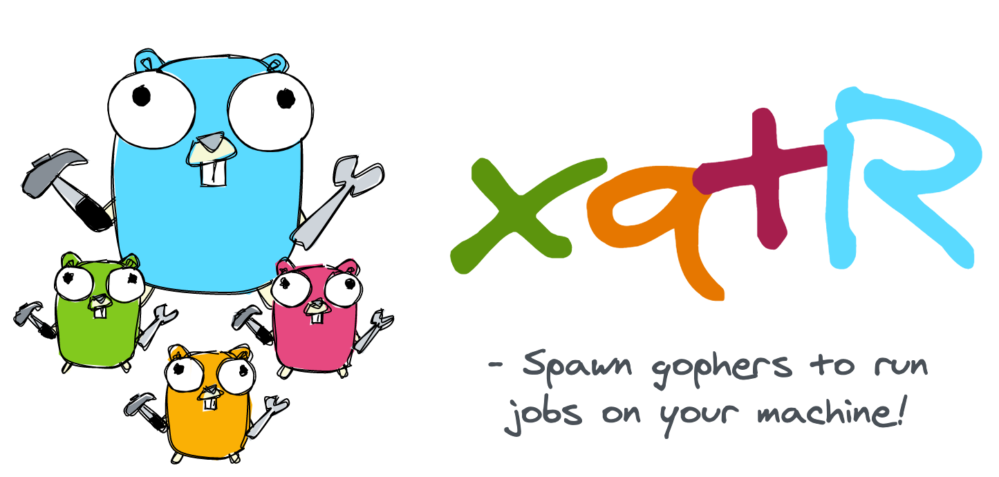
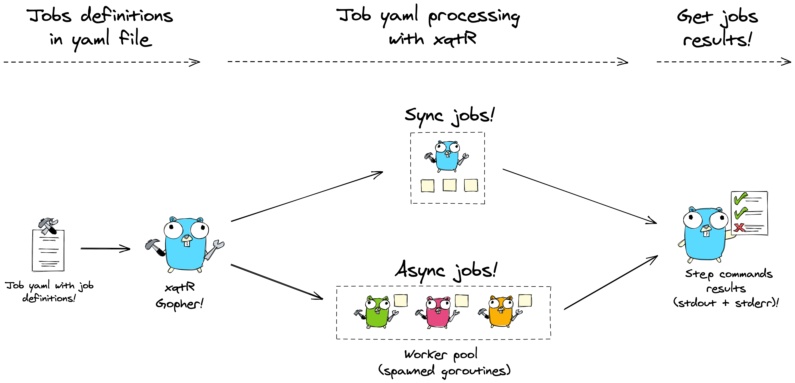

# 🛠️ xqtR (executoR) 🛠️



`xqtR` (short for executor) is a command line tool to execute a series of jobs specified by job yaml files. The steps in a job can be run concurrently (by spawning goroutines in a workpool) or in the old fashioned sync way (default).

A quick demo of running a `job.yaml` which contains a job whose steps will be run by a single main goroutine (sync):


Now, a similar `job.yaml` which runs the same steps but spawns goroutines (async) to run the steps in parallel (when possible) according to `num_workers` in the yaml file:


The name of this project was inspired on the retired Norwegian professional counter-strike player: `XeqtR` (yes, I miss old cs times)!

## Table of Contents

- [Introduction](#Introduction)
  - [How does it work](#How-does-it-work)
  - [How to install](#How-to-install)
- [How to Use](#How-to-use)
  - [Job Yaml Schema](#Job-yaml-schema)
  - [Stdout and Stderr](#Stdout-and-stderr)
  - [Sync and Async Jobs](#Sync-and-async-jobs)
  - [Dealing with Errors](#Dealing-with-errors)

## Introduction

`xqtR` (short for executor) is a command line tool that parses `job.yaml` files, which have, perhaps, similar syntax to github action yaml files, in order to execute a series of jobs and steps on your machine. Optionally, as mentioned below, the jobs can be executed concurrently by spawning goroutines.

Hence, this project is inspired by modern CICD tools such as `Azure DevOps` and `Github Actions` that use `yaml` files to configure a sequence of steps known as pipelines. Naturally, this is an ultra-and-I-really-mean-it-simplifed-version of these famous yaml parsers to run jobs! And yes, this project was also used to explore some concurrency in GO.

However, besides being simple, this tool can be useful in cases like configuring new machines in which a sequence of programs must be downloaded and installed (also, maybe some steps can be run concurrently... just be careful that package managers such as `brew` will can detect other `brew` processes and raise errors in these situations). Also, beware of race conditions (as usual) when using async jobs with many goroutines! For example, if for a given job `num_workers: 3` is set to three, then three possibly parallel processes can end up trying to write to a same file which will generate unexpected results/errors.

As a rule of thumb: when in doubt if concurrent processes can be damaging, just do not specify the `num_workers` key as the job's steps will run in a sync and safe way.

## How does it work



`xqtR` parses yaml files looking for **jobs** that are composed of a series of **steps**. Each step contains commands that, in the current version, are read and used to spawn new OS processes which will invoke the system shell (currently only `bash` -- so Windows users be warned for now) in order to execute them.

Here's the full job yaml concepts:

- A job yaml file is composed of **jobs**
- Jobs are composed of **steps**
- Steps are composed of **run instructions**
- Run instructions are commands that will be executed on your system shell (bash only for now)

The spawned processes are plugged to os pipes that captures their `stdstreams` (`stdout` and `stderr`) which can be used to display errors, warnings, or the command's `stdout` when the tool's `--log-level` is set to `debug`.

## How to install

This will be improved in the future, but, as of now, each code that is pushed to the `main` branch triggers a pipeline that runs tests, SonarCloud (Sonarqube) analysis and publishes releases to Github that contains `xqtR` latest binaries.

Hence, to install, just download the `xqtR` binary from the latest Github Release of this repo for your desired OS (currently only `macOS` and `Linux (ubuntu)` -- might work on other Linux distros too are supported -- and put the program binary into your `$PATH` variable to use the executable anywhere in your shell. It will probably be necessary to change de permission bits of the binary with `chmod` to make it executable by your OS user.

So, for now, no `Windows` support (not yet!!)

## How to use

The best way to get to know `xqtR` is by using its help commands! Just open up your favorite shell and invoke the `help` command, like so:

```sh
xqtr -h
```

And (hopefully) a nice explanation will tell you how to use it! The most imoprtant subcommand (and the one you will use) is `xqtr run`! It contains some help too:

```sh
xqtr run -h
```

The run command, in its simplest form, is the case when you have a `job.yaml` file on the same directory of `xqtr` binary file! If not, just to the [Job Yaml Schema](#Job-yaml-schema) section and create one on same dir as the `xqtr` binary! Then run:

```sh
xqtr run  # same as xqtr run --file ./job.yaml (looks for a job.yaml file on the current workdir)
```

If the job yaml file is somewhere else:

```sh
xqtr run --file relative/path/to/job.yaml
```

And that's it!

### Job yaml schema

The yaml files are used to describe jobs that will be executed by `xqtR`! The main concepts are as follows:

- A job yaml file is composed of **jobs**
- Jobs are composed of **steps**
- Steps are composed of **run instructions**
- Run instructions are commands that will be executed on your system shell (bash only for now)

Here's a `job.yaml` schema so far:

```yaml
jobs:
  - title: string # the job's display name
    continue_on_error: false # whether or not xqtR should stop execution upon a step cmd error (defaults to false)
    num_workers: 3 # number of goroutines to use. By setting anything > 1, the steps will be run in an async fashion (defaults to 1)
    steps:
      - name: string # the step display name
        run: string # the command which will be invoked on a new system shell's process
      - name: string
        run: string
```

# Stdout and stderr

By default, `xqtR` will display only `stderr` in case of errors (step commands that run exit code different than zero) or when a command writes to stderr to display warnings, for example. If you desire to see the `stdout` of the commands too, decrease the log verbosity to `debug` with the `--log-level` flag:

```sh
xqtr run --file job.yaml --log-level debug  # log level is now debug (default is INFO)
```

Other log levels can be supplied like `warn`, `error`, etc. More at `xqtr run -h`.

## Sync and Async Jobs

The **jobs** are executed in a sequence (never in parallel). However, a job, when being executed, can run its **steps** in a worker pool (group of goroutines) defined by the param `num_workers`. Here's the `job.yaml` used in the `sync` demonstration gif that was used to create the video in the beginning of this README file:

```yaml
jobs:
  - title: running sync sleeps
    steps: # num_workers defaults to 1 -> runs synchronously the steps in this job
      - name: sleep 1
        run: sleep 1 && echo "slept for 1s"
      - name: sleep 2
        run: sleep 2 && echo "slept for 2s"
      - name: sleep 3
        run: sleep 3 && echo "slept for 3s"
```

The same steps can be run concurrently by specifying the key `num_workers` which maps to the number of goroutines that will be spawned (usually 3 is a good starting point):

```yaml
jobs:
  - title: running async sleeps
    num_workers: 3 # xqtR will spawn 3 goroutines to handle these steps: runs asynchronously the steps in this job
    steps:
      - name: sleep 1
        run: sleep 1 && echo "slept for 1s"
      - name: sleep 2
        run: sleep 2 && echo "slept for 2s"
      - name: sleep 3
        run: sleep 3 && echo "slept for 3s"
```

## Dealing With Errors

As unfortunate as is, the steps' commands, once executed, can return non-zero return status codes due to some unexpected error such as file that's not found, a command typo, etc.! For dealing with errors, each `job` allows the key `continue_on_errors` which is a boolean that if set to `true` will capture the step process's stderr and print it whereas the other other steps (and also other jobs) will execute normally.

If `continue_on_errors` is set to `false` (default), then the behavior depends whether the current job is `sync` or `async`:

- If the job is `sync`: the steps after the current step (in the same job) that raised the error will NOT be executed. Here, differently than `async jobs`, one step that raises an error **WILL NOT ALLOW** subsequent steps in the same job to execute. Also, the next jobs and their steps will NOT be executed as well: `continue_on_errors: false` stops the current job and will not allow next jobs to run.

- If the job is `async` (i.e `num_workers` > 1): if a step of an async job raises an error, it will **NOT STOP** the other concurrent steps are being executed on the workpool in other goroutines (this is currently impossible: the workpool will execute all the steps and only after the results are collected). However, the next jobs **will NOT** execute. Hence `continue_on_errors: true` for an async job does not guarantee that a step that raises an error will stop the other concurrent steps of the same job: it will NOT, concurrent steps execute to completion (either a success or error), but it will prevent subsequent jobs to be executed.
